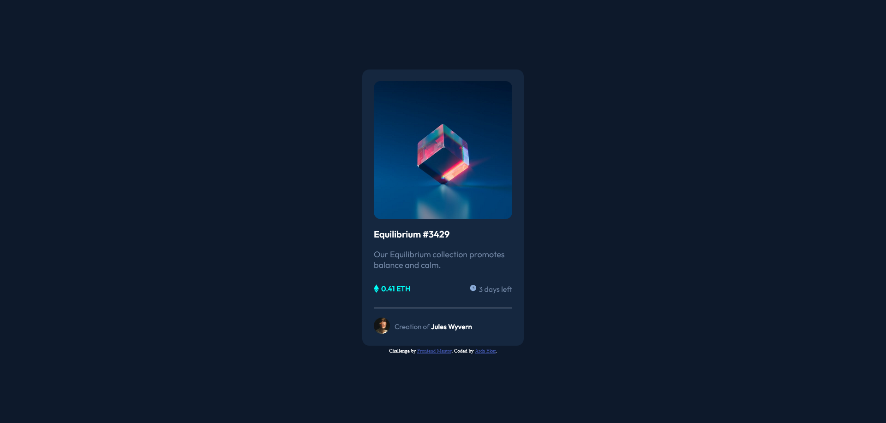
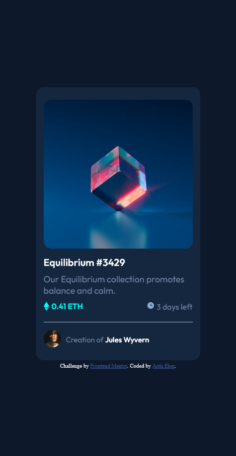

# Frontend Mentor - NFT preview card component solution

This is a solution to the [NFT preview card component challenge on Frontend Mentor](https://www.frontendmentor.io/challenges/nft-preview-card-component-SbdUL_w0U). Frontend Mentor challenges help you improve your coding skills by building realistic projects.

## Table of contents

- [Overview](#overview)
  - [The challenge](#the-challenge)
  - [Screenshot](#screenshot)
  - [Links](#links)
- [Author](#author)

## Overview

### The challenge

Users should be able to:

- View the optimal layout depending on their device's screen size
- See hover and focus states for interactive elements

### Screenshot

### Links

- Solution URL: [Solution URL here](https://www.frontendmentor.io/solutions/interactive-rating-component-_TI9Q3UMbv)
- Live Site URL: [Live site URL here](https://ardaekerforntendmentor-02.netlify.app/)

## Author

- Frontend Mentor - [@ardaekerFD](https://www.frontendmentor.io/profile/ardaekerFD)
